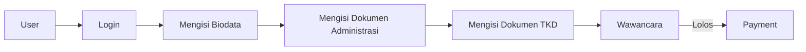
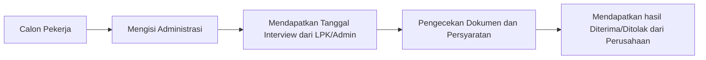

# MiraiWorks - Calon Pekerja Abroad

Sebuah aplikasi perantara calon pekerja dan Perusahaan Luar Negeri Khususnya **Jepang**

##  Architecture Application
Web App dibangun menggunakan architecture webservices yang terdiri dari **backend** dan **frontend**

### Tech Stack
- Backend App menggunakan framework Express.js
- Frontend App menggunakan React Vite js
- Database yang digunakan adalah Mysql

### Informasi Aplikasi
Dalam Aplikasi terdapat 3 Role utama
``` text
Role Calon Pekerja (User)
Role Supervisor (Perusahaan)
Role Administrator
```
#### Role Calon Pekerja
Pada role calon pekerja alur yang harus dilakukan antara lain:


Role ini hanya bisa melakukan pengisian administrasi dan menunggu informasi selanjutnya dari admin dan Perusahaan.

#### Role Supervisor
Pada Role Supervisor terdapat fitur - fitur berikut:
```text
- Pengecekan Biodata Calon Pekerja
- Pengecekan Dokumen Administrasi Pekerja
- Pengecekan Dokumen TKD
- Pengecekan Jadwal Interview
- Penerimaan Calon Pekerja (Pembuat Keputusan diterima atau ditolak)
```

#### Role Admin
Pada Role Admin terdapat fitur - fitur berikut:
```text
- Pengecekan Kelengkapan Administrasi Pekerja
- User Management
- Pemberian Tanggal Interview
```

## Overview Workflow

